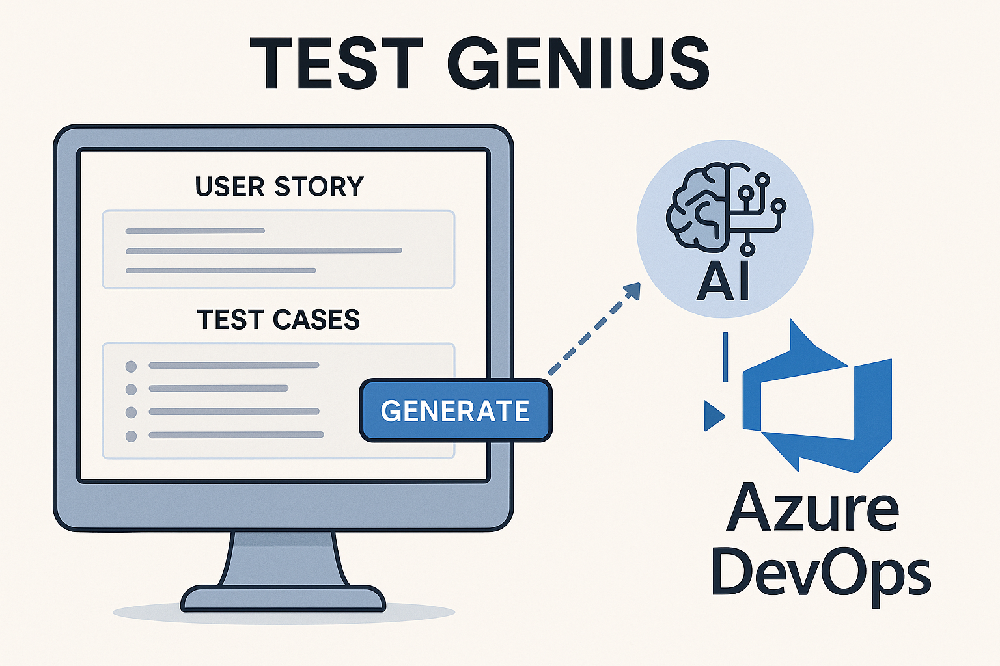

# TestGenius

An AI-powered web application that accelerates and enhances the software testing lifecycle by automatically generating comprehensive test cases from Azure DevOps user stories.



---

## 🚨 Problem

Manual test case creation is:
- Time-consuming and repetitive  
- Prone to inconsistency across teams  
- Difficult to ensure comprehensive coverage  
- Often not tightly integrated with Agile tools like Azure DevOps  

---

## ✅ Solution

TestGenius solves this by using AI to:
- Automatically generate **high-quality test cases** from user stories  
- Support **positive, negative, edge, and integration scenarios**  
- Allow editing and refining both user stories and generated test cases  
- Seamlessly **integrate back into Azure DevOps** test plans and suites  
- Offer test case export in Azure-compatible CSV format  

---

## 🧠 Key Features

- **🔐 Azure DevOps Integration**  
  Authenticate using organization URL, project name, and PAT. Fetch work items and upload test cases directly.

- **🤖 AI-Powered Test Case Generation**  
  Uses Google AI models via Genkit to generate comprehensive test cases from user stories and acceptance criteria.

- **🛠️ Test Case Management**  
  - Edit AI-generated test cases  
  - Create manual test cases  
  - Choose to append or replace test cases

- **📜 User Story Refinement**  
  Edit acceptance criteria before generating test cases for better accuracy.

- **📤 Seamless Upload**  
  Push test cases to Azure DevOps test plans and suites with real-time feedback and status.

- **📄 CSV Export**  
  Export test cases in Azure DevOps-compatible CSV format.

- **✨ Modern UI**  
  Built with ShadCN UI components and Tailwind CSS for an intuitive experience.

---

## 🔄 Workflow

1. **Authentication**  
   - Connect to Azure DevOps using organization URL, project name, and PAT.  
   - PAT is securely stored in local storage for session persistence.

2. **Fetch & Refine User Stories**  
   - Enter a work item ID to fetch story and acceptance criteria.  
   - Refine the criteria if needed before generation.

3. **Generate Test Cases**  
   - AI engine processes the input and generates comprehensive cases:  
     - Positive scenarios  
     - Negative scenarios  
     - Edge cases  
     - Integration/data flow validations

4. **Manage Test Cases**  
   - Edit, delete, or manually add new test cases.  
   - Choose between appending or replacing existing cases.

5. **Upload to Azure DevOps**  
   - Select a target test plan and suite.  
   - Upload test cases and view links to the created records.

6. **Export to CSV**  
   - Download test cases in CSV format compatible with Azure DevOps import.

---

## 🧰 Tech Stack

- **Frontend**: Next.js + Tailwind CSS + ShadCN UI  
- **AI Layer**: Genkit using Google Gemini models  
- **DevOps Integration**: Azure DevOps REST APIs  
- **State & Storage**: Local storage for secure credential caching  

---

## 📦 Installation

```bash
# Clone the repository
git clone https://github.com/yourusername/TestGenius.git

# Navigate to the project directory
cd TestGenius

# Install dependencies
npm install
```

---

## ▶️ Usage

```bash
# Start the development server
npm run dev

# Build for production
npm run build

# Run tests (if available)
npm test
```

---

## 🔐 Azure DevOps Permissions

The Personal Access Token (PAT) used in TestGenius requires:
- `Work Items (read & write)`
- `Test Management (read & write)`

---

## 🧪 Target Users

- QA engineers working with Azure DevOps  
- Agile teams looking to accelerate testing cycles  
- Test managers needing quick turnaround on test design  
- Organizations seeking to standardize test quality across teams  

---

## 🚀 Future Plans

- Support for **multi-language test case generation**  
- Integration with **Jira and TestRail**  
- Role-based access for **team collaboration**  
- Visual test flow mapping  
- End-to-end test scenario chaining  

---

## 🤝 Contributing

Contributions are welcome!

1. Fork the repository  
2. Create a feature branch: `git checkout -b feature/amazing-feature`  
3. Commit your changes: `git commit -m 'Add some amazing feature'`  
4. Push to your branch: `git push origin feature/amazing-feature`  
5. Open a Pull Request  

---

## 📄 License

This project is licensed under the **MIT License**. See the [LICENSE](./LICENSE) file for details.
